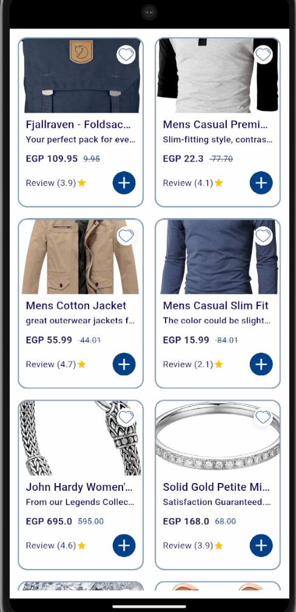
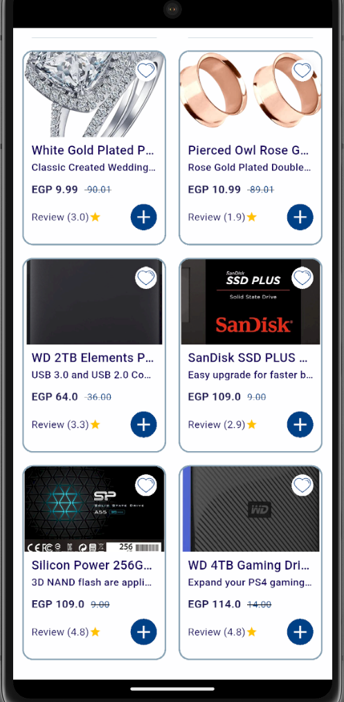

# Flutter Task Show Products App

A modern e-commerce products showcase application built with Flutter, implementing MVVM architecture and best practices.

## 📱 Screenshots

<div align="center">
  
  
</div>

## 🏗️ Project Structure

```
lib/
├── core/                   # Core functionality and utilities
│   ├── api/               # API related classes
│   │   ├── api_constant.dart
│   │   ├── dio_services.dart
│   │   └── api_consumer.dart
│   ├── Di/                # Dependency injection
│   │   └── get_it.dart
│   ├── spacing/           # Layout constants
│   └── utils/            # Utility classes
│       └── app_colors.dart
│
├── model/                # Data models
│   ├── product_model.dart
│   └── rating_model.dart
│
├── services/             # Repository and data handling
│   ├── products_repository.dart
│   └── products_repository_imp.dart
│
├── view/                # UI Components
│   ├── product_list_screen.dart
│   └── widget/          # Reusable widgets
│       ├── product_card.dart
│       ├── product_image.dart
│       ├── product_title.dart
│       ├── product_price.dart
│       └── favoriteButton.dart
│
├── viewModel/           # ViewModels and State Management
│   └── cubit/
│       └── products_cubit.dart    # Products ViewModel using Cubit
│
└── main.dart           # Entry point
```

## 🚀 Features

- MVVM Implementation
- Responsive UI Design
- State Management with Bloc/Cubit
- Dependency Injection using GetIt
- Networking with Dio
- Image Caching
- Error Handling
- Loading States with Shimmer

## 🛠️ Technical Stack

- **State Management**: flutter_bloc
- **Dependency Injection**: get_it
- **HTTP Client**: dio
- **Image Caching**: cached_network_image
- **Responsive UI**: flutter_screenutil
- **Model Equality**: equatable

## 🔧 Getting Started

### Prerequisites

- Flutter SDK (3.9.0 or higher)
- Dart SDK (3.0.0 or higher)
- Android Studio / VS Code

### Installation

1. Clone the repository:
```bash
git clone https://github.com/yourusername/flutter_task_products.git
```

2. Install dependencies:
```bash
flutter pub get
```

3. Run the app:
```bash
flutter run
```

## 🏛️ Architecture

This project follows MVVM (Model-View-ViewModel) architecture pattern:

1. **Model**
   - Data Models (product_model.dart, rating_model.dart)
   - Repository Pattern (products_repository.dart)
   - API Services (dio_services.dart)

2. **View**
   - UI Components (widgets/)
   - Screens (product_list_screen.dart)
   - User Interaction Handling

3. **ViewModel**
   - Business Logic (Cubits)
   - State Management
   - Data Transformation
   - Error Handling

## 🔍 Code Style

- Following Flutter's official style guide
- Using lint rules for consistent code
- Proper documentation for public APIs
- Meaningful variable and function names

## 🤝 Contributing

1. Fork the Project
2. Create your Feature Branch (`git checkout -b feature/AmazingFeature`)
3. Commit your Changes (`git commit -m 'Add some AmazingFeature'`)
4. Push to the Branch (`git push origin feature/AmazingFeature`)
5. Open a Pull Request

## 📝 License

This project is licensed under the MIT License - see the [LICENSE](LICENSE) file for details.

## 👤 Author

Your Name
- GitHub: [@HamedAhmed](https://github.com/yourusername)


## ⭐ Show your support

Give a ⭐️ if this project helped you!
